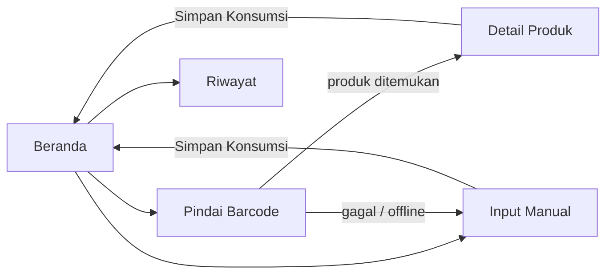

# Flutter Structure — SodiScan

Dokumen ini menjelaskan bagaimana aplikasi Flutter SodiScan diorganisasikan: prototype, struktur proyek, screen, routing, reusable widget, model, data source, dan state management. Latar belakang masalah dan fitur aplikasi ada di [`README.md`](README.md). Spesifikasi teknis lengkap ada di [`Architecture.md`](Architecture.md).

## Status Dokumen

Saat dokumen ini ditulis, repository **belum berisi source code Flutter** (belum ada folder `lib/` maupun `pubspec.yaml`). Karena itu, seluruh struktur di bawah adalah rencana. Setiap bagian diberi salah satu label berikut:

| Label | Arti |
|---|---|
| **Status: Recommended (Architecture.md)** | Belum diimplementasikan, tetapi sudah ditetapkan di `Architecture.md` (stack, entity, use case, halaman, struktur folder) |
| **Status: Recommended (usulan)** | Belum diimplementasikan dan belum ditetapkan; merupakan usulan dokumen ini, misalnya nama file atau pembagian provider |
| **Status: Implemented** | Sudah ada di source code. Saat ini belum ada bagian dengan status ini |

Setelah source code dibuat, dokumen ini perlu diperbarui agar sesuai dengan implementasi aktual.

### Perbandingan dengan contoh struktur umum

Contoh struktur Flutter yang umum (`routes/`, `screens/`, `widgets/`, `models/`, `services/`, dengan halaman Login dan Profile) dipakai sebagai acuan cara menjelaskan. Penerapannya di SodiScan disesuaikan sebagai berikut:

| Contoh umum | Di SodiScan | Alasan |
|---|---|---|
| `login_screen`, `profile_screen` | Tidak ada | Aplikasi tanpa akun dan autentikasi |
| `dashboard_screen` | Beranda (`home/`) | Menampilkan total natrium dan status harian |
| `routes/app_routes.dart` | `Navigator` bawaan | Tidak ada package routing di stack yang ditetapkan |
| `screens/`, `widgets/` | `presentation/screens/`, `presentation/widgets/` | Dikelompokkan per layer (Clean Architecture) |
| `models/user_model.dart` | `data/models/` + `domain/entities/` | Tidak ada data user; data utamanya produk dan konsumsi |
| `services/auth_service.dart` | `data/datasources/` + repository | Peran service dijalankan oleh data source (API dan Hive) |

## 1. Prototype

**Status: Recommended (Architecture.md)**

Prototype adalah rancangan awal UI/UX sebelum logika aplikasi dibuat. Saat ini belum ada desain Figma di repository. Prototype SodiScan direncanakan sebagai **mock UI Flutter**, yaitu screen Flutter dengan data dummy tanpa Provider, API, atau Hive. Screen-screen ini kemudian dihubungkan ke state management secara bertahap.

Lima screen yang dirancang (sesuai *Halaman aplikasi* di `Architecture.md`):

| Screen | Tujuan | Informasi utama | Interaksi pengguna | Fitur terkait |
|---|---|---|---|---|
| Beranda | Memantau natrium hari ini | Total natrium vs batas 2.000 mg, badge status, daftar konsumsi hari ini | Tap `Pindai Barcode`, `Input Manual`, buka Riwayat | Total harian, status risiko |
| Pindai Barcode | Membaca barcode produk | Preview kamera, loading saat mencari | Arahkan kamera ke barcode; tap `Input Manual` | Barcode scanner, Open Food Facts |
| Detail Produk | Konfirmasi produk sebelum dicatat | Nama, merek, takaran saji, natrium, hasil hitung | Isi jumlah porsi/berat; tap `Simpan Konsumsi` | Informasi natrium, pencatatan konsumsi |
| Input Manual | Fallback jika produk tidak ditemukan atau offline | Form nama produk dan natrium (mg) | Isi form; tap `Simpan Konsumsi` | Manual input, offline fallback |
| Riwayat | Melihat konsumsi sebelumnya | Daftar per tanggal, total dan status per tanggal | Scroll daftar | Riwayat konsumsi |

Aturan tampilan yang perlu tercermin di prototype:

- Semua teks dalam Bahasa Indonesia.
- Memakai kartu, badge, form, dan empty state.
- Setiap halaman yang memuat data punya state loading, kosong, dan error.
- Warna badge: Aman = hijau, Mendekati Batas = oranye, Bahaya = merah.
- Tidak ada chart di versi pertama.

## 2. Project Structure

**Status: Recommended (Architecture.md)**

SodiScan memakai Clean Architecture dengan empat bagian utama di `lib/`:

```text
lib/
├── main.dart
├── core/
├── data/
│   ├── datasources/
│   │   ├── local/
│   │   └── remote/
│   ├── models/
│   └── repositories/
├── domain/
│   ├── entities/
│   ├── repositories/
│   └── usecases/
└── presentation/
    ├── providers/
    ├── screens/
    └── widgets/
```

| Folder | Isi | Contoh di SodiScan |
|---|---|---|
| `core/` | Komponen umum yang dipakai lintas bagian | Konstanta (batas 2.000 mg, ambang 1.500 mg, URL API, timeout 10 detik), tipe error, utilitas format tanggal |
| `data/` | Sumber data dan implementasi repository | Akses Open Food Facts, akses Hive, model JSON/Hive |
| `domain/` | Aturan bisnis, tidak bergantung pada Flutter, Hive, atau `http` | Entity, kontrak repository, use case, aturan status risiko |
| `presentation/` | Semua yang berhubungan dengan UI | Screen, widget, provider |

Alasan pemisahan:

- **Domain bebas dari Flutter dan library luar.** Perhitungan natrium dan status risiko bisa di-unit-test tanpa emulator.
- **Presentation tidak mengenal sumber data.** UI tidak perlu berubah jika cara mengambil data berubah.
- **Tanggung jawab jelas.** Setiap folder punya satu peran, sehingga mudah dicari dan dikerjakan bersama.

## 3. Main Entry Point

### `lib/main.dart`

**Status: Recommended (Architecture.md)**

`main.dart` adalah titik awal aplikasi:

```text
main()
  ↓
WidgetsFlutterBinding.ensureInitialized()
  ↓
Inisialisasi Hive (hive_flutter) dan buka box "consumptions"
  ↓
Siapkan dependency: DataSource → RepositoryImpl → UseCase
  ↓
Daftarkan Provider (MultiProvider)
  ↓
runApp()
```

### `lib/app.dart`

**Status: Recommended (usulan, opsional)**

`app.dart` tidak tercantum di `Architecture.md`. File ini disarankan jika `main.dart` mulai terlalu panjang. Isinya:

- root widget (`MaterialApp`);
- theme aplikasi, termasuk warna status risiko;
- halaman awal dan konfigurasi navigasi;
- konfigurasi global seperti judul aplikasi dan locale.

Jika tidak dipakai, isi tersebut tetap berada di `main.dart`.

## 4. Screens / Pages

**Status: Recommended (Architecture.md** untuk daftar screen; **usulan** untuk nama folder/file**)**

```text
presentation/
└── screens/
    ├── home/             home_screen.dart
    ├── scanner/          scanner_screen.dart
    ├── product_detail/   product_detail_screen.dart
    ├── manual_input/     manual_input_screen.dart
    └── history/          history_screen.dart
```

| Screen | Responsibility | Main Interaction | Sumber data |
|---|---|---|---|
| Home (Beranda) | Monitoring natrium harian | Melihat total dan status; membuka Scanner, Input Manual, Riwayat | Lokal (Hive), tanpa API |
| Scanner (Pindai Barcode) | Membaca barcode dengan `mobile_scanner` | Scan produk; berpindah ke Input Manual | Open Food Facts lewat provider |
| Product Detail | Menampilkan informasi produk dan menghitung natrium | Isi porsi/berat, konfirmasi `Simpan Konsumsi` | Produk hasil scan |
| Manual Input | Mencatat natrium secara manual | Isi nama produk dan natrium (> 0 mg), simpan | Lokal (Hive) |
| History (Riwayat) | Menampilkan konsumsi per tanggal | Melihat konsumsi sebelumnya | Lokal (Hive) |

Prinsip screen: screen hanya menampilkan state dari provider dan meneruskan aksi pengguna. Screen tidak melakukan HTTP request, tidak mengakses Hive, dan tidak menghitung status risiko.

## 5. Routing / Navigation

**Status: Recommended (usulan)**, mengikuti batasan di `Architecture.md` (tidak ada package routing)

SodiScan cukup memakai **`Navigator` bawaan Flutter**. Tidak ada `go_router` atau package routing lain, dan folder `routes/` tidak diperlukan.



| Aspek | Cara di SodiScan |
|---|---|
| Definisi route | Langsung dengan `Navigator.push(MaterialPageRoute(...))`. Alternatifnya named routes di `MaterialApp(routes: ...)` dengan konstanta nama route di `core/constants/` |
| Memanggil screen | Tombol di Beranda membuka Scanner, Input Manual, atau Riwayat |
| Route parameter | Detail Produk menerima entity `Product` lewat constructor. Screen lain tidak butuh parameter |
| Kembali (back) | Tombol back bawaan untuk kembali satu halaman. Setelah `Simpan Konsumsi`, kembali ke Beranda dengan `Navigator.popUntil(context, (route) => route.isFirst)` |

## 6. Reusable Components / Widgets

**Status: Recommended (usulan)**

Widget dibuat reusable hanya jika memang muncul di lebih dari satu screen atau tampilannya harus konsisten.

```text
presentation/
└── widgets/
    ├── primary_button.dart
    ├── sodium_summary_card.dart
    ├── risk_status_badge.dart
    ├── consumption_tile.dart
    ├── empty_state.dart
    └── error_state.dart
```

| Widget | Fungsi | Digunakan di | Alasan reusable |
|---|---|---|---|
| `PrimaryButton` | Tombol aksi utama | Beranda, Scanner, Detail Produk, Input Manual | Gaya tombol seragam |
| `SodiumSummaryCard` | Total natrium vs batas 2.000 mg + badge | Beranda, header per tanggal di Riwayat | Ringkasan yang sama muncul di dua tempat |
| `RiskStatusBadge` | Badge Aman / Mendekati Batas / Bahaya | Beranda, Riwayat | Warna hijau/oranye/merah harus konsisten |
| `ConsumptionTile` | Satu baris konsumsi (nama, natrium, waktu) | Beranda, Riwayat | Item daftar yang sama |
| `EmptyState` | Pesan saat data kosong | Beranda, Riwayat | Pola kosong yang sama |
| `ErrorState` | Pesan error + aksi lanjutan | Scanner, Beranda, Riwayat | Pola error yang sama |

Yang **tidak** perlu dijadikan reusable:

- **`ProductCard`**: informasi produk hanya tampil di Detail Produk.
- **`AppTextField`**: cukup `TextFormField` biasa, kecuali styling field di Detail Produk dan Input Manual memang dibuat sama.
- **Loading indicator**: `CircularProgressIndicator` bawaan sudah cukup.

`RiskStatusBadge` hanya menampilkan status. Penentuan status (aman, mendekati batas, bahaya) dilakukan di domain, bukan di widget.

## 7. Models and Data Representation

### Entity

**Status: Recommended (Architecture.md)**

Entity berada di `domain/entities/` dan mewakili konsep bisnis tanpa ketergantungan pada Flutter, Hive, atau JSON.

| Entity | Field |
|---|---|
| `Product` | barcode, name, brand, servingSize, sodiumPer100gMg, sodiumPerServingMg |
| `FoodConsumption` | id, barcode, productName, sodiumMg, source, consumedAt |
| `DailyNutrition` | date, totalSodiumMg, dailyLimitMg, riskStatus |
| `RiskStatus` (enum) | `safe`, `nearLimit`, `danger` |

Nilai `riskStatus` ditetapkan di `Architecture.md`. Menjadikannya enum bernama `RiskStatus` adalah usulan.

### Model

**Status: Recommended (usulan** untuk nama file**)**

Model berada di `data/models/` dan mengurus bentuk data teknis:

```text
data/
└── models/
    ├── product_model.dart            JSON Open Food Facts → Product
    └── food_consumption_model.dart   data Hive ↔ FoodConsumption
```

| | Model | Entity |
|---|---|---|
| Lokasi | `data/models/` | `domain/entities/` |
| Tugas | Parsing JSON, konversi natrium g × 1.000 → mg, serialisasi Hive | Mewakili konsep bisnis |
| Dipakai oleh | Data source dan repository | Use case, provider, screen |

Tidak ada `daily_nutrition_model.dart`. Menurut `Architecture.md`, `DailyNutrition` tidak disimpan, tetapi dihitung dari `FoodConsumption` pada tanggal yang sama.

## 8. Data Sources / Services

**Status: Recommended (Architecture.md** untuk perilaku; **usulan** untuk nama file**)**

SodiScan tidak memakai folder `services/` generik. Peran service dijalankan oleh dua data source:

```text
data/
└── datasources/
    ├── remote/
    │   └── open_food_facts_remote_data_source.dart
    └── local/
        └── consumption_local_data_source.dart
```

| Data source | Tanggung jawab |
|---|---|
| **Remote**: Open Food Facts | Request ke Open Food Facts API v2 berdasarkan barcode memakai `http`, timeout 10 detik, parsing response menjadi `ProductModel`, melempar error yang jelas (produk tidak ditemukan, natrium kosong, offline, API gagal). Hanya membaca; data pengguna tidak pernah dikirim |
| **Local**: Hive | Menyimpan dan membaca `FoodConsumption` di Hive box `consumptions`, mengambil data per tanggal dan seluruh riwayat. Satu-satunya tempat yang menyentuh Hive |

Aturan penting: UI dan provider tidak boleh melakukan API request atau mengakses Hive secara langsung.

## 9. Repository

**Status: Recommended (Architecture.md** untuk pola repository; **usulan** untuk nama file**)**

Repository adalah perantara antara domain dan sumber data. Domain hanya mengenal kontraknya (interface), tanpa tahu data berasal dari API atau Hive.

```text
domain/
└── repositories/
    ├── product_repository.dart          kontrak: getProductByBarcode
    └── consumption_repository.dart      kontrak: simpan, ambil per tanggal, ambil semua

data/
└── repositories/
    ├── product_repository_impl.dart     → remote data source
    └── consumption_repository_impl.dart → local data source
```

```text
Screen
  ↓
Provider (state management)
  ↓
Use Case
  ↓
Repository (interface, domain)
  ↓
Repository Impl (data)
  ↓
Data Source (Open Food Facts / Hive)
```

Repository juga mengubah model menjadi entity, dan menerjemahkan error teknis (misalnya timeout atau tidak ada koneksi) menjadi error yang dipahami aplikasi.

Use case yang ditetapkan di `Architecture.md`:

| Use case | Tugas |
|---|---|
| `GetProductByBarcode` | Validasi barcode, ambil `Product` |
| `RecordConsumption` | Validasi natrium > 0, simpan konsumsi (hasil scan dan input manual) |
| `GetDailySummary` | Hitung total natrium dan status risiko untuk satu tanggal |
| `GetConsumptionHistory` | Ambil riwayat konsumsi per tanggal |

## 10. State Management

**Status: Recommended (Architecture.md** untuk Provider; **usulan** untuk pembagian provider**)**

SodiScan memakai **Provider** (`ChangeNotifier`). Provider menyimpan state halaman, memanggil use case, lalu memberi tahu UI agar diperbarui.

```text
Screen  ──watch/read──▶  Provider  ──▶  Use Case  ──▶  Repository  ──▶  Data Source
   ▲                        │
   └──── notifyListeners ───┘
```

Usulan pembagian provider:

```text
presentation/
└── providers/
    ├── product_lookup_provider.dart   pencarian produk dari hasil scan
    ├── daily_summary_provider.dart    ringkasan hari ini + simpan konsumsi
    └── history_provider.dart          riwayat per tanggal
```

| Provider | State yang dikelola |
|---|---|
| `ProductLookupProvider` | idle, loading, produk ditemukan, error (dengan pesan dan arahan ke Input Manual) |
| `DailySummaryProvider` | loading, `DailyNutrition` hari ini, daftar konsumsi hari ini, status simpan, error |
| `HistoryProvider` | loading, kosong, daftar per tanggal, error |

Batasan:

- Provider hanya memanggil use case. Provider tidak mengimpor `http`, Hive, atau model data.
- Aturan bisnis seperti ambang status risiko berada di domain, bukan di provider atau widget.

## 11. Relationship Between Components

```text
Prototype
    ↓  menentukan isi dan alur halaman
Screens
    ↓  menyusun tampilan dari
Reusable Widgets
    ↓  menampilkan data dari
State Management (Provider)
    ↓  menjalankan
Use Cases
    ↓  meminta data lewat
Repositories
    ↓  mendelegasikan ke
Data Sources
    ↓
Open Food Facts API / Hive
```

| Bagian | Tanggung jawab |
|---|---|
| Prototype | Rancangan tampilan dan alur pengguna; bukan kode |
| Screen | Mengatur tampilan dan interaksi satu halaman |
| Widget | Komponen UI yang dipakai berulang |
| Provider | Mengelola state (loading, data, error) dan memperbarui UI |
| Use Case | Menjalankan satu operasi bisnis |
| Repository | Menyembunyikan asal data dari domain |
| Data Source | Berkomunikasi langsung dengan API atau Hive |

## 12. SodiScan Main Flow

**Status: Recommended (Architecture.md)**

Contoh end-to-end: memindai produk lalu mencatat konsumsinya.

```text
User
  ↓
Scanner Screen                     kamera aktif (mobile_scanner)
  ↓  barcode terdeteksi, deteksi berikutnya dihentikan
ProductLookupProvider              state: loading
  ↓
GetProductByBarcode                validasi barcode
  ↓
ProductRepository
  ↓
Open Food Facts Remote Data Source
  ↓
Open Food Facts API v2             timeout 10 detik
  ↓
JSON → ProductModel                natrium g × 1.000 = mg
  ↓
Product (entity)
  ↓
Product Detail Screen              user mengisi porsi/berat, melihat hasil hitung
  ↓  user tap "Simpan Konsumsi"
DailySummaryProvider
  ↓
RecordConsumption                  validasi natrium > 0
  ↓
ConsumptionRepository
  ↓
Consumption Local Data Source → Hive box "consumptions"
  ↓
GetDailySummary                    total harian dihitung ulang
  ↓                                status risiko ditentukan di domain
Beranda                            total dan badge status diperbarui
```

Penjelasan singkat:

1. Scanner membaca barcode, lalu provider meminta data produk lewat use case.
2. Repository mengambil data dari Open Food Facts dan mengubah JSON menjadi entity `Product`.
3. Pengguna mengonfirmasi jumlah yang dikonsumsi di Detail Produk.
4. `RecordConsumption` menyimpan konsumsi ke Hive.
5. Total harian dan status risiko dihitung ulang dari data hari itu, lalu Beranda menampilkan hasilnya.

Jalur gagal: jika produk tidak ditemukan, data natrium kosong, offline, atau API gagal, Scanner menampilkan pesan yang jelas dan mengarahkan ke **Input Manual**. Input Manual menyimpan data lewat `RecordConsumption` yang sama, mulai dari langkah 4.

## 13. Recommended Final Structure

**Status: Recommended (Architecture.md** untuk folder; **usulan** untuk nama file dan `app.dart`**)**

```text
SodiScan/
│
├── README.md
├── Architecture.md
├── Flutter-Structure.md
│
├── lib/
│   ├── main.dart                      inisialisasi Hive, dependency, Provider, runApp
│   ├── app.dart                       (opsional) MaterialApp dan theme
│   │
│   ├── core/
│   │   ├── constants/                 batas natrium, ambang status, URL API, timeout
│   │   ├── errors/                    tipe error/failure
│   │   └── utils/                     format tanggal dan angka
│   │
│   ├── data/
│   │   ├── datasources/
│   │   │   ├── local/                 consumption_local_data_source.dart
│   │   │   └── remote/                open_food_facts_remote_data_source.dart
│   │   ├── models/                    product_model.dart, food_consumption_model.dart
│   │   └── repositories/              product_repository_impl.dart, consumption_repository_impl.dart
│   │
│   ├── domain/
│   │   ├── entities/                  product.dart, food_consumption.dart, daily_nutrition.dart
│   │   ├── repositories/              product_repository.dart, consumption_repository.dart
│   │   └── usecases/                  get_product_by_barcode.dart, record_consumption.dart,
│   │                                  get_daily_summary.dart, get_consumption_history.dart
│   │
│   └── presentation/
│       ├── providers/                 product_lookup_provider.dart, daily_summary_provider.dart,
│       │                              history_provider.dart
│       ├── screens/                   home/, scanner/, product_detail/, manual_input/, history/
│       └── widgets/                   primary_button.dart, sodium_summary_card.dart,
│                                      risk_status_badge.dart, consumption_tile.dart,
│                                      empty_state.dart, error_state.dart
│
├── test/                              unit test perhitungan natrium dan status risiko
│
└── pubspec.yaml                       provider, hive, hive_flutter, mobile_scanner, http
```

Struktur ini sengaja tidak memuat backend, autentikasi, Firebase, cloud database, atau package routing tambahan, karena semuanya di luar scope SodiScan.

## 14. Implemented vs Recommended

| Bagian | Status | Keterangan |
|---|---|---|
| `README.md`, `Architecture.md`, `Flutter-Structure.md` | **Implemented** | Dokumentasi sudah ada di repository |
| Source code Flutter (`lib/`, `test/`, `pubspec.yaml`) | Belum ada | Belum dibuat |
| Stack: Flutter, Provider, Hive, `mobile_scanner`, `http`, Open Food Facts | Recommended (Architecture.md) | Ditetapkan, belum diimplementasikan |
| Struktur folder `core/`, `data/`, `domain/`, `presentation/` | Recommended (Architecture.md) | Ditetapkan, belum diimplementasikan |
| Lima screen (Beranda, Pindai Barcode, Detail Produk, Input Manual, Riwayat) | Recommended (Architecture.md) | Ditetapkan, belum diimplementasikan |
| Entity `Product`, `FoodConsumption`, `DailyNutrition` | Recommended (Architecture.md) | Ditetapkan, belum diimplementasikan |
| Use case `GetProductByBarcode`, `RecordConsumption`, `GetDailySummary`, `GetConsumptionHistory` | Recommended (Architecture.md) | Ditetapkan, belum diimplementasikan |
| Hive box `consumptions`, aturan status risiko, timeout 10 detik | Recommended (Architecture.md) | Ditetapkan, belum diimplementasikan |
| Prototype dalam bentuk mock UI Flutter | Recommended (usulan) | Belum ada desain Figma |
| `app.dart` | Recommended (usulan) | Opsional |
| Navigasi dengan `Navigator` bawaan | Recommended (usulan) | Mengikuti batasan tanpa package routing |
| Nama file screen, widget, model, data source, repository, provider | Recommended (usulan) | Dapat berubah saat implementasi |
| Enum `RiskStatus` dan pembagian tiga provider | Recommended (usulan) | Dapat berubah saat implementasi |

Saat source code mulai dibuat, ubah status bagian yang sudah ada menjadi **Implemented**, lalu sesuaikan nama file dan class di dokumen ini dengan kode sebenarnya.
