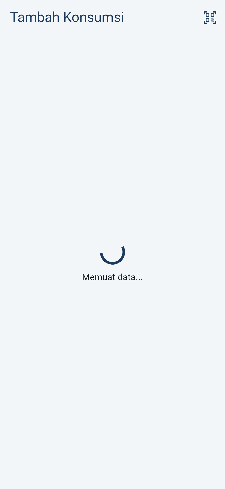
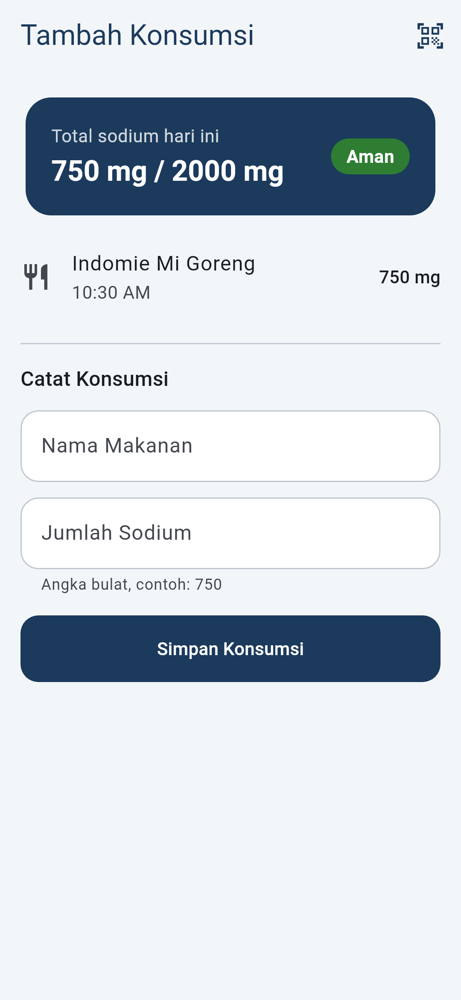
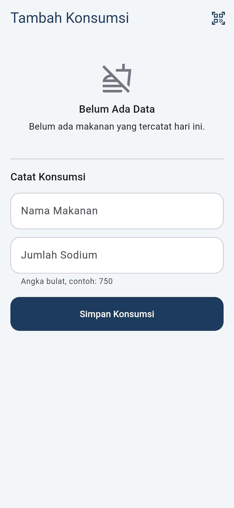
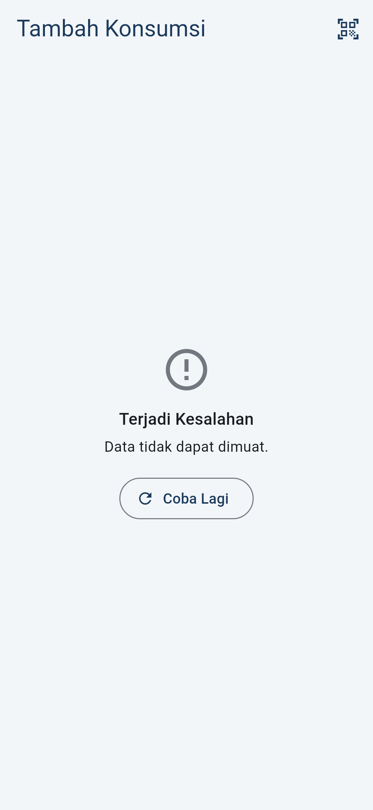
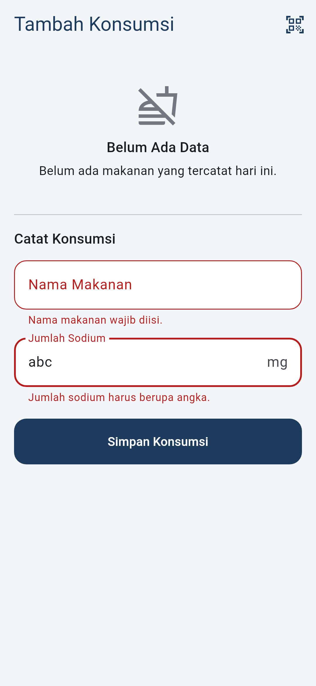
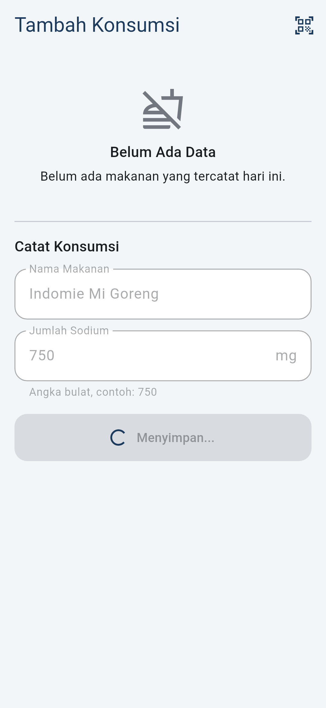
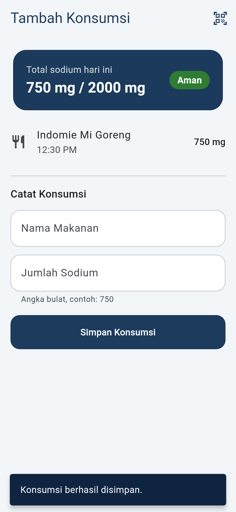
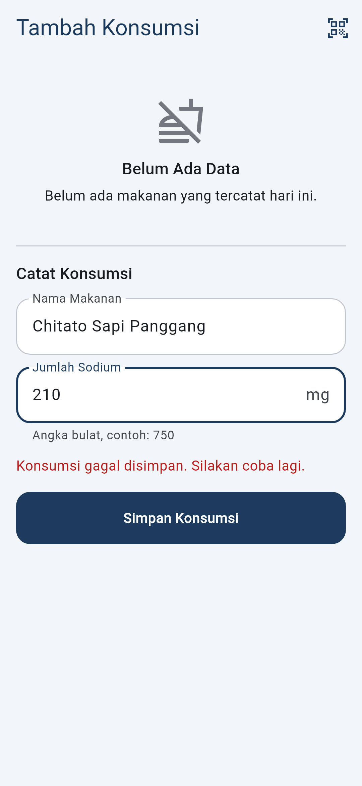

# Feature: Tambah Konsumsi (Add Food Consumption)

Dokumen ini menjelaskan feature **Tambah Konsumsi** pada SodiScan, yaitu feature Flutter yang menerapkan state management (Provider), form dengan validasi, dan enam kondisi UI, beserta widget test-nya.

## A. Feature Implementation Plan

| Bagian | Isi |
|---|---|
| Feature | Mencatat konsumsi sodium secara manual dan menampilkan konsumsi hari ini beserta total dan status risiko |
| Screen | `AddConsumptionScreen` (judul: *Tambah Konsumsi*) |
| State management | Provider (`ChangeNotifier`), sesuai `Architecture.md` |
| State | `AddConsumptionState`: `loadStatus` (loading / success / empty / error), `summary`, `loadErrorMessage`, `isSubmitting`, `submitErrorMessage` |
| Notifier | `AddConsumptionNotifier`: `load()`, `retry()`, `submit()` |
| Use case | `GetDailySummary` (memuat dan menjumlahkan konsumsi hari ini), `RecordConsumption` (validasi aturan bisnis, lalu menyimpan) |
| Repository | `ConsumptionRepository` (kontrak di domain), `ConsumptionRepositoryImpl` (implementasi di data) |
| Data source | `ConsumptionLocalDataSource` → Hive box `consumptions` |
| Model / entity | `FoodConsumptionModel` (Map Hive) ↔ `FoodConsumption`; `DailyNutrition`; `RiskStatus` |
| Test | Widget test untuk setiap state, unit test notifier/use case, test repository dengan Hive sungguhan di folder sementara |

Alur data:

```text
Hive box "consumptions"
        ↓
ConsumptionLocalDataSource
        ↓
ConsumptionRepositoryImpl
        ↓
GetDailySummary / RecordConsumption
        ↓
AddConsumptionNotifier (state)
        ↓
AddConsumptionScreen + ConsumptionForm
```

Feature ini belum memakai barcode scanner dan Open Food Facts, karena keduanya berada di feature Pindai Barcode yang terpisah. Data yang dimuat berasal dari Hive, sesuai prinsip Local-First. `RecordConsumption` sudah menerima parameter `source` dan `barcode`, sehingga nanti bisa dipakai juga oleh hasil scan.

## B. Project / File Structure

Struktur mengikuti `Architecture.md` (layer `core`, `data`, `domain`, `presentation`), bukan folder `features/`.

```text
lib/
├── main.dart                                        init Hive, buka box, buat repository
├── app.dart                                         ChangeNotifierProvider + MaterialApp
├── core/
│   ├── constants/sodium_constants.dart              batas 2000 mg, ambang 1500 mg
│   ├── errors/failures.dart                         Failure, ValidationFailure, StorageFailure
│   └── utils/sodium_format.dart                     format "750 mg"
├── data/
│   ├── datasources/local/consumption_local_data_source.dart
│   ├── models/food_consumption_model.dart
│   └── repositories/consumption_repository_impl.dart
├── domain/
│   ├── entities/food_consumption.dart
│   ├── entities/daily_nutrition.dart
│   ├── entities/risk_status.dart
│   ├── repositories/consumption_repository.dart
│   └── usecases/
│       ├── get_daily_summary.dart
│       └── record_consumption.dart
└── presentation/
    ├── providers/
    │   ├── add_consumption_state.dart
    │   └── add_consumption_notifier.dart
    ├── screens/add_consumption/
    │   ├── add_consumption_screen.dart
    │   ├── consumption_form.dart
    │   └── consumption_form_validators.dart
    └── widgets/
        ├── consumption_tile.dart
        ├── risk_status_badge.dart
        └── state_message.dart

test/
├── helpers/fake_consumption_repository.dart
├── domain/risk_status_test.dart
├── domain/usecases_test.dart
├── data/consumption_repository_impl_test.dart
└── presentation/
    ├── providers/add_consumption_notifier_test.dart
    └── screens/add_consumption/add_consumption_screen_test.dart

test_screenshots/capture_states_test.dart            membuat screenshot di docs/screenshots/
```

Catatan perbedaan dengan `Architecture.md`: entity `DailyNutrition` diberi field tambahan `consumptions` (daftar konsumsi hari itu), agar screen bisa menampilkan daftar dan total dari satu hasil use case.

## C. State dan Transisi

```text
AddConsumptionState
├── loadStatus: loading | success | empty | error
├── summary: DailyNutrition?
├── loadErrorMessage: String?
├── isSubmitting: bool
└── submitErrorMessage: String?
```

| Kondisi UI | Representasi state |
|---|---|
| Initial Loading | `loadStatus == loading` (nilai awal state) |
| Success | `loadStatus == success`, `summary` berisi konsumsi |
| Empty | `loadStatus == empty` (repository berhasil, daftar kosong) |
| Error + Retry | `loadStatus == error`, `loadErrorMessage` |
| Submitting | `isSubmitting == true` |
| Submit Success | `submit()` mengembalikan `true`, ringkasan dimuat ulang |
| Submit Error | `submitErrorMessage` terisi, `isSubmitting` kembali `false` |

```text
Load awal:  Loading → Success | Empty | Error
Retry:      Error → (tap "Coba Lagi") → notifier.retry() → load() → Loading → Success | Empty | Error
Submit:     Success/Empty → isi form → validator Form → isSubmitting = true → RecordConsumption
            → berhasil: isSubmitting = false → ringkasan dimuat ulang → SnackBar, form dikosongkan
            → gagal:    isSubmitting = false → submitErrorMessage tampil, isi form tetap ada
```

Validasi form (`consumption_form_validators.dart`):

| Field | Aturan | Pesan |
|---|---|---|
| Nama Makanan | wajib diisi | `Nama makanan wajib diisi.` |
| Jumlah Sodium | wajib diisi | `Jumlah sodium wajib diisi.` |
| Jumlah Sodium | angka bulat (`int.tryParse`) | `Jumlah sodium harus berupa angka.` |
| Jumlah Sodium | lebih dari 0 | `Jumlah sodium harus lebih dari 0.` |

`RecordConsumption` mengecek ulang aturan yang sama (nama tidak kosong, sodium > 0 dan berhingga). Dengan begitu aturan bisnis tetap aman walaupun use case dipanggil dari tempat lain selain form ini.

Perlindungan double submit ada dua lapis:

1. **UI:** `onPressed: isSubmitting ? null : _submit`, sehingga tombol nonaktif dan field `enabled: false`.
2. **Action:** baris pertama `AddConsumptionNotifier.submit()` adalah `if (_state.isSubmitting) return false;`.

## D. Testing

### Cara menjalankan

```bash
flutter pub get
flutter analyze
flutter test
```

Untuk membuat ulang screenshot di `docs/screenshots/add_consumption/`:

```bash
flutter test test_screenshots --update-goldens
```

Semua test memakai `FakeConsumptionRepository` (`test/helpers/`), jadi tidak butuh internet, kamera, atau database production. Repository palsu ini bisa diatur untuk sukses, kosong, gagal load, gagal simpan, atau "menahan" proses lewat `Completer` (`loadGate`, `saveGate`), sehingga state loading bisa diuji tanpa `Future.delayed`.

| Test | File | Yang dibuktikan |
|---|---|---|
| State 1 - Initial Loading | `add_consumption_screen_test.dart` | `CircularProgressIndicator` dan teks `Memuat data...` tampil, form belum tampil |
| State 2 - Success | `add_consumption_screen_test.dart` | `Indomie Mi Goreng`, `750 mg`, total `750 mg / 2000 mg`, badge `Aman` |
| State 3 - Empty | `add_consumption_screen_test.dart` | `Belum Ada Data`, tanpa pesan error |
| State 4 - Error + Retry | `add_consumption_screen_test.dart` | Pesan error dan `Coba Lagi`; tap memanggil repository lagi (`loadCalls == 2`), tampil loading, lalu data |
| State 5 - Validation | `add_consumption_screen_test.dart` | Pesan untuk input kosong, `abc`, `0`, `-50`; repository tidak dipanggil (`saveCalls == 0`) |
| State 6 - Submit Loading | `add_consumption_screen_test.dart` | `Menyimpan...` + spinner, `onPressed == null`, tap kedua dan `submit()` kedua tidak menambah `saveCalls`, data tersimpan satu kali |
| Submit Error | `add_consumption_screen_test.dart` | Pesan gagal simpan tampil, isi form tetap, tombol aktif lagi |
| Notifier | `add_consumption_notifier_test.dart` | Transisi loading/success/empty/error, double submit diabaikan, submit error |
| Use case & aturan risiko | `domain/` | Ambang 1500/2000 mg, total hanya hari ini, validasi `RecordConsumption` |
| Repository + Hive | `data/consumption_repository_impl_test.dart` | Data benar-benar tersimpan di Hive dan terbaca kembali per tanggal |

## E. Testing Evidence

Screenshot dibuat dari widget test `test_screenshots/capture_states_test.dart` (render Flutter test, ukuran layar 360×780 logical px, font Roboto). Ini adalah **render widget test, bukan rekaman dari emulator atau HP**. Untuk bukti dari perangkat, jalankan `flutter run` dan rekam layar sendiri.

| # | State | Action | Expected | Evidence |
|---|---|---|---|---|
| 1 | Initial Loading | Screen dibuka, repository belum selesai memuat | Spinner dan `Memuat data...` |  |
| 2 | Success | Repository mengembalikan 1 konsumsi | Kartu total, badge, daftar konsumsi, form |  |
| 3 | Empty | Repository mengembalikan daftar kosong | `Belum Ada Data`, form tetap tersedia |  |
| 4 | Error + Retry | Repository gagal memuat | `Terjadi Kesalahan`, `Data tidak dapat dimuat.`, tombol `Coba Lagi` |  |
| 5 | Form Validation | Nama kosong, sodium `abc`, tap `Simpan Konsumsi` | Pesan validasi di bawah tiap field |  |
| 6 | Submit Loading | Form valid, tap `Simpan Konsumsi`, penyimpanan ditahan | Tombol nonaktif, spinner, `Menyimpan...`, field nonaktif |  |
| 7 | Submit Success | Penyimpanan berhasil | SnackBar `Konsumsi berhasil disimpan.`, daftar dan total diperbarui, form kosong |  |
| 8 | Submit Error | Penyimpanan gagal | `Konsumsi gagal disimpan. Silakan coba lagi.`, isi form tetap |  |

Kolom **Actual result** diisi setelah Anda menjalankan `flutter test` sendiri:

| Perintah | Actual result (isi sendiri) |
|---|---|
| `flutter analyze` | |
| `flutter test` | |
| `flutter run` di emulator/HP | |

## F. AI Assistance

### AI Tool

Claude Code (Anthropic), dijalankan sebagai sesi Claude Code di cloud yang terhubung ke repository ini.

### Purpose

- Membuat kerangka project Flutter (Android dan iOS) dan `pubspec.yaml`.
- Mengimplementasikan layer domain, data, dan presentation untuk feature Tambah Konsumsi.
- Membuat fake repository, widget test, unit test, dan test repository dengan Hive.
- Membuat screenshot state dari widget test.
- Menyusun dokumen ini.

### Prompt Used

> Tempelkan di sini prompt lengkap yang Anda kirim ke Claude Code, yaitu prompt yang diawali dengan "ROLE — Bertindak sebagai Senior Flutter Developer sekaligus Code Reviewer yang membantu saya mengimplementasikan satu feature nyata pada aplikasi SodiScan." dan berisi bagian 1–29 serta FINAL INSTRUCTION. Jangan meringkas atau mengubahnya, karena tugas meminta prompt yang benar-benar digunakan.

### Perbaikan yang dilakukan selama sesi AI

Bagian ini mencatat perbaikan yang terjadi selama pembuatan kode. Perbaikan ini dilakukan oleh AI berdasarkan hasil pengecekan, **bukan** review manual Anda.

| Temuan | Perbaikan |
|---|---|
| Analyzer melaporkan lint `prefer_initializing_formals` di notifier | Batas SDK di `pubspec.yaml` diturunkan ke `^3.8.0` agar project juga cocok dengan Flutter yang lebih lama |
| Saat guard `isSubmitting` di notifier dihapus sementara untuk pengecekan, test State 6 menggantung, bukan gagal | Test diubah: submit kedua tidak di-`await` sebelum penyimpanan pertama selesai. Tanpa guard, test kini gagal jelas (`Expected: <1>, Actual: <2>`). Dengan guard, test lulus |
| Test use case memakai `expect(() => future, throwsA(...))` | Diganti `await expectLater(...)` agar pengecekan Future berurutan |
| Input `1.000` (format ribuan Indonesia) akan terbaca 1 mg jika memakai `double.tryParse` | Sodium dibatasi angka bulat dengan `int.tryParse`, sehingga `1.000` ditolak sebagai bukan angka |
| `double.tryParse('NaN')` menghasilkan nilai NaN, bukan `null` | `RecordConsumption` menolak nilai yang tidak berhingga (`!sodiumMg.isFinite`) |
| Screenshot awal menangkap animasi label dan pesan error yang belum selesai | Ditambahkan frame tambahan sebelum screenshot diambil |

## Manual Code Review

Isi bagian ini setelah Anda membaca dan memahami kodenya sendiri. Centang hanya bagian yang benar-benar sudah Anda periksa.

- [ ] **State management:** `lib/presentation/providers/add_consumption_notifier.dart`. Pahami kapan `loadStatus` berubah dan kenapa `_emit` mengecek `_isDisposed`.
- [ ] **Validation:** `consumption_form_validators.dart` dan `record_consumption.dart`. Pahami kenapa validasi ada di dua tempat (form untuk pesan ke pengguna, use case untuk aturan bisnis).
- [ ] **Repository:** `consumption_repository_impl.dart`. Pahami cara data difilter per tanggal dan kenapa error Hive diubah menjadi `StorageFailure`.
- [ ] **Submit flow:** `consumption_form.dart` `_submit()`. Urutannya validate → `notifier.submit()` → jika berhasil, reset form dan tampilkan SnackBar. Pahami kenapa ada pengecekan `mounted`.
- [ ] **Double-tap prevention:** guard di `submit()` dan `onPressed: null` di tombol. Coba hapus guard lalu jalankan test State 6, dan lihat test gagal.
- [ ] **Widget tests:** `add_consumption_screen_test.dart` dan `fake_consumption_repository.dart`. Pahami fungsi `loadGate` dan `saveGate`.

### Manual Corrections (isi sendiri)

```text
AI-generated:
...

I reviewed:
...

I changed:
...
```

## Student Understanding

Draf berikut ditulis berdasarkan implementasi feature ini. **Tulis ulang dengan kata-kata Anda sendiri** sebelum dikumpulkan.

- **Why State Management?** Satu screen punya banyak kondisi (loading, success, empty, error, submitting, submit error). `AddConsumptionNotifier` menyimpan kondisi itu di satu objek `AddConsumptionState`, sehingga widget cukup membaca state dan menampilkan UI yang sesuai, tanpa menyimpan flag sendiri-sendiri.
- **Why Repository?** Widget tidak tahu data disimpan di Hive. Karena widget hanya bergantung pada `ConsumptionRepository`, test bisa memakai `FakeConsumptionRepository` tanpa Hive, dan penyimpanan bisa diganti tanpa mengubah UI.
- **Why Form Validation?** Nilai sodium dipakai untuk menghitung total harian dan status risiko. Input kosong, `abc`, `0`, atau negatif akan merusak total, jadi form menolak input itu sebelum use case dipanggil.
- **Why Submit Loading?** Penyimpanan bersifat asynchronous. Tanpa tombol nonaktif dan guard `isSubmitting`, dua tap cepat akan menyimpan konsumsi yang sama dua kali dan total sodium menjadi salah. Test State 6 membuktikan `saveCalls` tetap 1.
- **Why Widget Tests?** Setiap state punya tampilan dan perilaku berbeda. Widget test memastikan setiap state benar-benar muncul dari state notifier (bukan dari delay buatan), dan mencegah perubahan kode di masa depan merusak salah satunya tanpa ketahuan.
