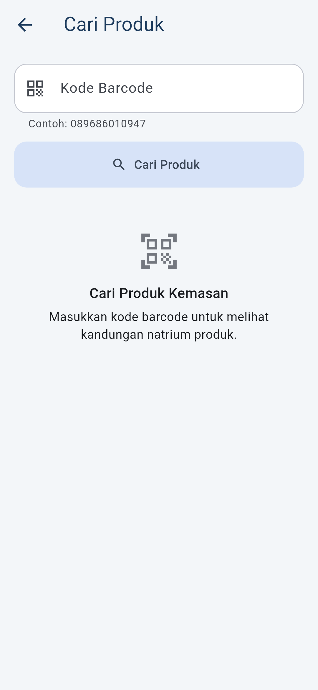
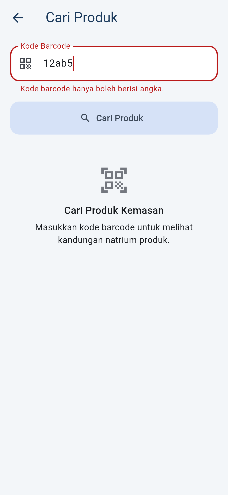
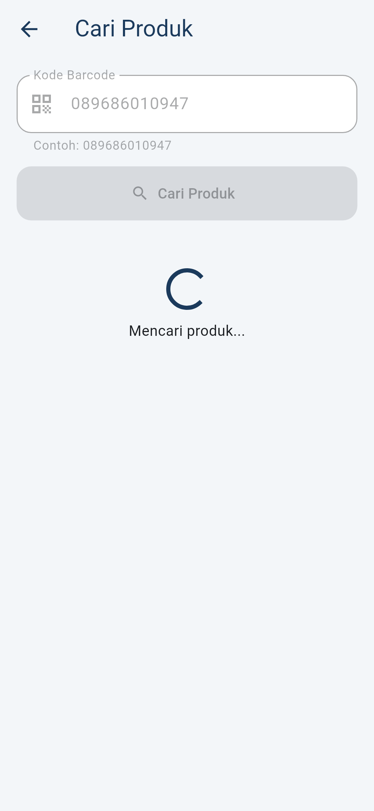
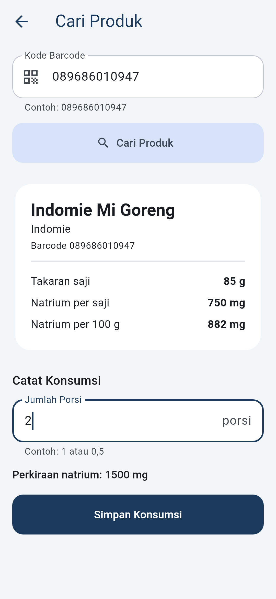
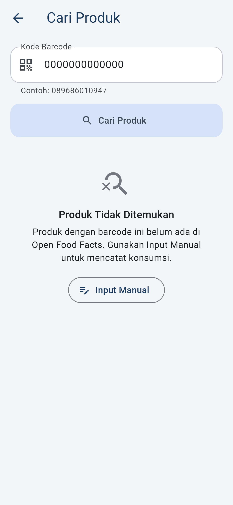
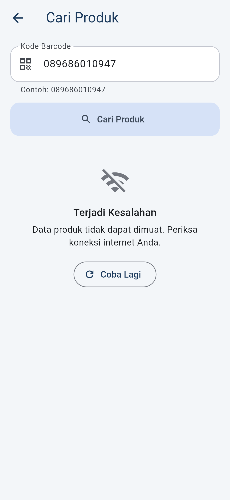
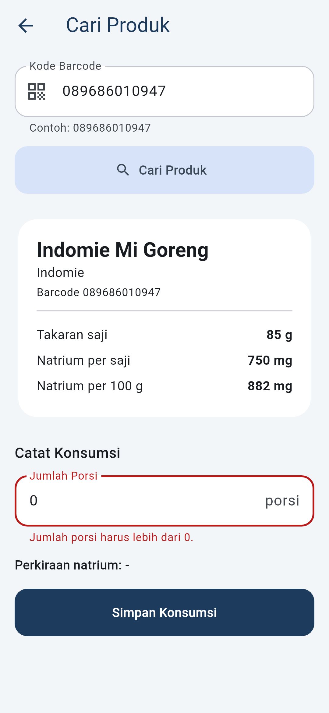
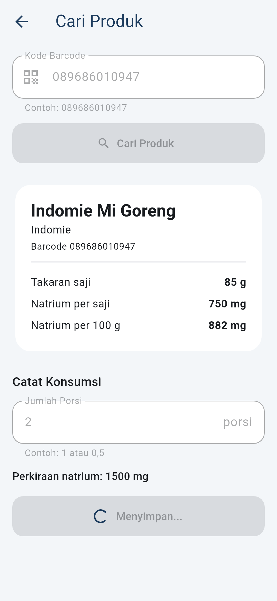
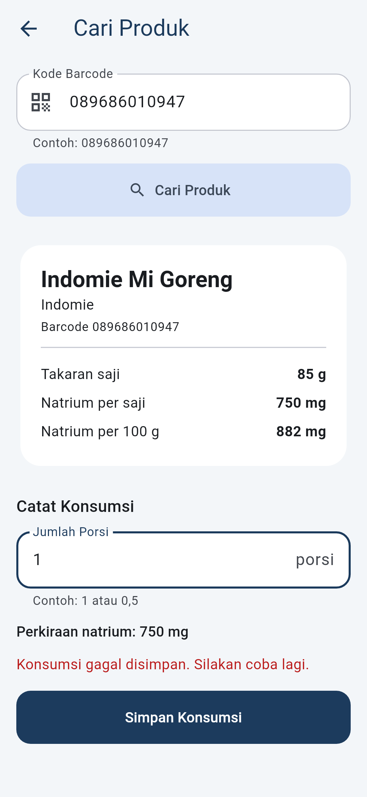

# Feature: Cari Produk via Barcode (Product Lookup)

Feature kedua SodiScan yang menerapkan state management (Provider), form, dan validasi. Pengguna memasukkan kode barcode, aplikasi mengambil data produk dari Open Food Facts, lalu pengguna mencatat konsumsinya berdasarkan jumlah porsi atau berat.

Feature ini dibuka dari tombol ikon barcode di AppBar layar **Tambah Konsumsi**. Setelah konsumsi tersimpan, layar ditutup dan ringkasan harian di layar Tambah Konsumsi dimuat ulang.

## A. Feature Implementation Plan

| Bagian | Isi |
|---|---|
| Screen | `ProductLookupScreen` (judul: *Cari Produk*) |
| State management | Provider (`ChangeNotifier`), sama dengan feature Tambah Konsumsi |
| State | `ProductLookupState`: `status` (idle / loading / success / empty / error), `barcode`, `product`, `message`, `isSubmitting`, `submitErrorMessage` |
| Notifier | `ProductLookupNotifier`: `search()`, `retry()`, `submit()` |
| Use case | `GetProductByBarcode` (validasi barcode, ambil produk), `RecordConsumption` (dipakai bersama dengan feature 1) |
| Repository | `ProductRepository` (kontrak di domain), `ProductRepositoryImpl` (implementasi di data) |
| Data source | `OpenFoodFactsRemoteDataSource` → `GET https://world.openfoodfacts.org/api/v2/product/{barcode}.json`, timeout 10 detik |
| Model / entity | `ProductModel` (JSON Open Food Facts, natrium g × 1000 = mg) → `Product` |
| Test | Widget test setiap state, unit test notifier, use case, entity, data source (dengan `MockClient`, tanpa internet) |

Alur data:

```text
ProductLookupScreen (BarcodeSearchForm, PortionForm)
        ↓  context.read / context.watch
ProductLookupNotifier
        ↓
GetProductByBarcode          RecordConsumption
        ↓                            ↓
ProductRepository            ConsumptionRepository
        ↓                            ↓
OpenFoodFactsRemoteDataSource  ConsumptionLocalDataSource
        ↓                            ↓
Open Food Facts API          Hive box "consumptions"
```

## B. File Structure

```text
lib/
├── core/errors/failures.dart                        + NetworkFailure
├── data/
│   ├── datasources/remote/open_food_facts_remote_data_source.dart
│   ├── models/product_model.dart
│   └── repositories/product_repository_impl.dart
├── domain/
│   ├── entities/product.dart                        Product, ConsumptionUnit, sodiumFor()
│   ├── repositories/product_repository.dart
│   └── usecases/get_product_by_barcode.dart
└── presentation/
    ├── providers/
    │   ├── product_lookup_state.dart
    │   └── product_lookup_notifier.dart
    └── screens/product_lookup/
        ├── product_lookup_screen.dart               screen + route() dengan ChangeNotifierProvider
        ├── barcode_search_form.dart                 form barcode
        ├── product_info_card.dart                   kartu data produk
        ├── portion_form.dart                        form porsi/berat + tombol simpan
        └── product_lookup_validators.dart

test/
├── helpers/fake_product_repository.dart
├── domain/product_test.dart
├── data/open_food_facts_remote_data_source_test.dart
└── presentation/
    ├── providers/product_lookup_notifier_test.dart
    └── screens/product_lookup/product_lookup_screen_test.dart

test_screenshots/capture_product_lookup_test.dart    membuat screenshot di docs/screenshots/product_lookup/
```

File yang diubah: `lib/app.dart` (menyediakan `GetProductByBarcode` dan `RecordConsumption` lewat `MultiProvider`), `lib/main.dart` (membuat `ProductRepositoryImpl` dengan `http.Client`), `add_consumption_screen.dart` (tombol ke Cari Produk), `add_consumption_notifier.dart` (`refresh()`), `state_message.dart` (ikon tombol bisa diatur), `pubspec.yaml` (`http`), dan `AndroidManifest.xml` (izin `INTERNET`).

## C. State dan Transisi

| Kondisi UI | Representasi state | Tampilan |
|---|---|---|
| Awal (sebelum cari) | `status == idle` | Petunjuk "Cari Produk Kemasan" |
| Validasi barcode | `validateBarcode` di `Form` | Pesan di bawah field barcode, notifier tidak dipanggil |
| Loading | `status == loading` | Spinner + "Mencari produk...", tombol Cari nonaktif |
| Success | `status == success`, `product` terisi | Kartu produk + form porsi |
| Empty | `status == empty` | "Produk Tidak Ditemukan" / "Data Natrium Tidak Tersedia" + tombol **Input Manual** |
| Error + Retry | `status == error` | "Terjadi Kesalahan" + tombol **Coba Lagi** (`retry()` memakai barcode terakhir) |
| Validasi porsi | `validateAmount` di `Form` | Pesan di bawah field porsi/berat |
| Submitting | `isSubmitting == true` | "Menyimpan..." + spinner, tombol simpan dan tombol cari nonaktif |
| Submit success | `submit()` mengembalikan `true` | SnackBar, layar ditutup dengan hasil `true` |
| Submit error | `submitErrorMessage` terisi | Pesan gagal simpan, isi form tetap |

```text
Idle → (form barcode valid) → Loading → Success | Empty | Error
Error → (Coba Lagi) → retry() → search(barcode terakhir) → Loading → Success | Empty | Error
Empty → (Input Manual) → kembali ke layar Tambah Konsumsi
Success → (form porsi valid) → isSubmitting = true → RecordConsumption
        → berhasil: pop(true) → layar Tambah Konsumsi memanggil refresh()
        → gagal:    isSubmitting = false, submitErrorMessage tampil
```

Validasi:

| Field | Aturan | Pesan |
|---|---|---|
| Kode Barcode | wajib diisi | `Kode barcode wajib diisi.` |
| Kode Barcode | hanya angka | `Kode barcode hanya boleh berisi angka.` |
| Kode Barcode | 8–13 digit (EAN-8 sampai EAN-13) | `Kode barcode harus 8 sampai 13 digit.` |
| Jumlah Porsi / Berat | wajib diisi | `Jumlah porsi wajib diisi.` / `Berat wajib diisi.` |
| Jumlah Porsi / Berat | angka (boleh desimal, koma atau titik) | `... harus berupa angka.` |
| Jumlah Porsi / Berat | lebih dari 0 | `... harus lebih dari 0.` |

`GetProductByBarcode` mengecek ulang format barcode, dan `RecordConsumption` mengecek ulang natrium > 0, sehingga aturan bisnis tetap aman di luar form.

Perhitungan natrium ada di entity `Product.sodiumFor()`: jika ada data per saji, natrium = per saji × jumlah porsi; jika hanya ada data per 100 g, natrium = per 100 g × berat / 100. Hasilnya ditampilkan sebagai "Perkiraan natrium" sebelum disimpan.

Pencegahan double submit:

1. **UI:** `onPressed: isSubmitting ? null : _submit` di tombol Simpan, dan tombol Cari nonaktif selama loading/submit.
2. **Action:** `submit()` diawali `if (_state.isSubmitting || ...) return false;`, dan `search()` diawali `if (_state.status == LookupStatus.loading || _state.isSubmitting) return;`.

## D. Testing

```bash
flutter pub get
flutter analyze
flutter test
flutter test test_screenshots --update-goldens   # membuat ulang screenshot
```

Test tidak memakai internet, kamera, atau Hive asli. `FakeProductRepository` mengatur hasil pencarian (produk, `null`, gagal) dan bisa menahan proses dengan `lookupGate`. `OpenFoodFactsRemoteDataSource` diuji dengan `MockClient` dari package `http`.

| Test | File | Yang dibuktikan |
|---|---|---|
| Idle | `product_lookup_screen_test.dart` | Petunjuk tampil sebelum pencarian |
| Validasi barcode | `product_lookup_screen_test.dart` | Kosong, `12ab5678`, `12345` ditolak; repository tidak dipanggil |
| Loading | `product_lookup_screen_test.dart` | Spinner, "Mencari produk...", tombol Cari nonaktif |
| Success | `product_lookup_screen_test.dart` | Nama produk, `750 mg`, `882 mg`, form porsi |
| Empty | `product_lookup_screen_test.dart` | Produk tidak ditemukan dan tanpa data natrium; tombol Input Manual menutup layar |
| Error + Retry | `product_lookup_screen_test.dart` | Tombol Coba Lagi memanggil repository lagi dengan barcode yang sama, tampil loading lalu data |
| Validasi porsi | `product_lookup_screen_test.dart` | Kosong, `dua`, `0` ditolak; tidak ada data tersimpan |
| Perhitungan per 100 g | `product_lookup_screen_test.dart` | 50 g × 520 mg/100 g = `260 mg` |
| Submit loading | `product_lookup_screen_test.dart` | "Menyimpan...", tombol nonaktif, submit kedua ditolak, tersimpan sekali dengan sumber `scan` dan barcode, layar ditutup dengan `true` |
| Submit error | `product_lookup_screen_test.dart` | Pesan gagal simpan, isi form tetap, tombol aktif lagi |
| Notifier | `product_lookup_notifier_test.dart` | Transisi state, retry, pencarian ganda diabaikan, double submit diabaikan |
| Entity & use case | `domain/product_test.dart` | Perhitungan natrium, validasi barcode |
| Data source & repository | `data/open_food_facts_remote_data_source_test.dart` | Parsing JSON, g → mg, 404/status 0 → tidak ditemukan, error 500/timeout/offline → `NetworkFailure` |

## E. Testing Evidence

Screenshot dibuat dari widget test `test_screenshots/capture_product_lookup_test.dart` (render widget test 360×780, bukan rekaman HP).

| # | State | Action | Expected | Evidence |
|---|---|---|---|---|
| 1 | Idle | Layar dibuka | Petunjuk pencarian |  |
| 2 | Validasi barcode | Isi `12ab5`, tap Cari Produk | `Kode barcode hanya boleh berisi angka.` |  |
| 3 | Loading | Cari barcode valid, API belum merespons | Spinner, tombol Cari nonaktif |  |
| 4 | Success | API mengembalikan produk, isi 2 porsi | Data produk, perkiraan `1500 mg` |  |
| 5 | Empty | Barcode tidak ada di Open Food Facts | `Produk Tidak Ditemukan` + Input Manual |  |
| 6 | Error + Retry | Koneksi gagal | `Terjadi Kesalahan` + Coba Lagi |  |
| 7 | Validasi porsi | Isi `0`, tap Simpan | `Jumlah porsi harus lebih dari 0.` |  |
| 8 | Submit loading | Tap Simpan, penyimpanan ditahan | `Menyimpan...`, semua tombol nonaktif |  |
| 9 | Submit error | Penyimpanan gagal | `Konsumsi gagal disimpan. Silakan coba lagi.` |  |

Hasil yang dijalankan sendiri (isi setelah menjalankan perintahnya):

| Perintah | Actual result |
|---|---|
| `flutter analyze` | |
| `flutter test` | |
| `flutter run` + cari barcode asli (misalnya `089686010947`) | |

Catatan: pemanggilan ke API Open Food Facts yang asli **belum diuji** dari environment tempat kode ini dibuat, karena domain tersebut diblokir oleh jaringannya. Format respons mengikuti dokumentasi API v2 dan diuji dengan `MockClient`. Uji coba ke API asli perlu dilakukan dengan `flutter run`. Jika memakai Chrome dan pencarian selalu gagal, periksa tab Console di DevTools untuk error CORS.

## F. AI Assistance

### AI Tool

Claude Code (Anthropic).

### Purpose

Membuat feature Cari Produk (domain, data, presentation), fake repository dan semua test, screenshot dari widget test, dan dokumen ini.

### Prompt Used

> Tempelkan prompt yang benar-benar Anda kirim, misalnya: "kalau gitu buatkan fitur keduanya dan berikan code yg bisa langsung di extract atau copy dong ke local saya agar saya bisa push kke github tugas saya yg minggu ini", beserta prompt sebelumnya yang meminta rekomendasi fitur kedua.

### Perbaikan yang dilakukan selama sesi AI

| Temuan | Perbaikan |
|---|---|
| 3 widget test gagal karena tombol Simpan berada di luar layar test 800×600, dan tap meleset tanpa peringatan (`warnIfMissed: false`) | `ensureVisible` diikuti `pump()` sebelum tap, dan peringatan tap meleset diaktifkan kembali |
| Perlu bukti bahwa test double submit benar-benar menangkap bug | Guard `isSubmitting` di `submit()` dihapus sementara: 2 test gagal (`saveCalls` = 2). Guard dikembalikan, semua test lulus |
| Header `User-Agent` khusus tidak bisa diatur dari browser (Flutter web) | Request dikirim tanpa header khusus agar sama di Android dan web |
| Build Android rilis butuh izin internet | Ditambahkan `<uses-permission android:name="android.permission.INTERNET" />` |
| Kode pengambil screenshot terduplikasi di dua file | Dipindah ke `test_screenshots/screenshot_helpers.dart` |

### Manual Code Review (isi sendiri)

- [ ] `product_lookup_notifier.dart`: kapan `status` berubah, dan kenapa `retry()` memakai `state.barcode`.
- [ ] `product_lookup_validators.dart` dan `get_product_by_barcode.dart`: kenapa barcode 8–13 digit.
- [ ] `product.dart` `sodiumFor()`: perhitungan per saji vs per 100 g.
- [ ] `product_repository_impl.dart`: semua error jaringan diubah menjadi `NetworkFailure`.
- [ ] `portion_form.dart` `_submit()`: validate → `submit()` → SnackBar → `pop(true)`.
- [ ] `product_lookup_screen_test.dart`: fungsi `lookupGate`, `saveGate`, dan host `Builder` untuk membaca hasil `pop`.

```text
AI-generated:
...

I reviewed:
...

I changed:
...
```
